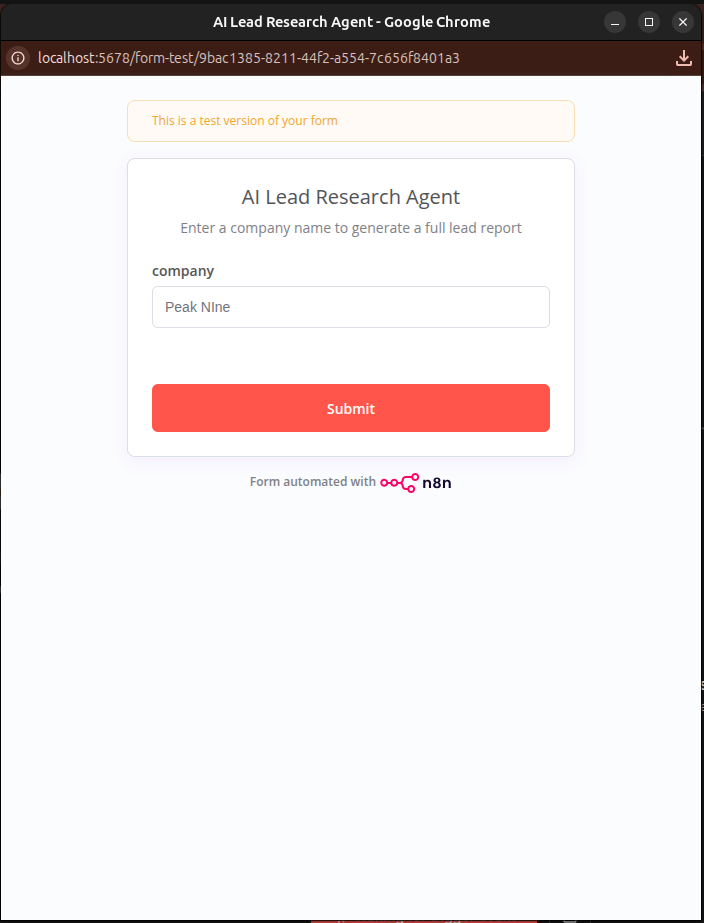
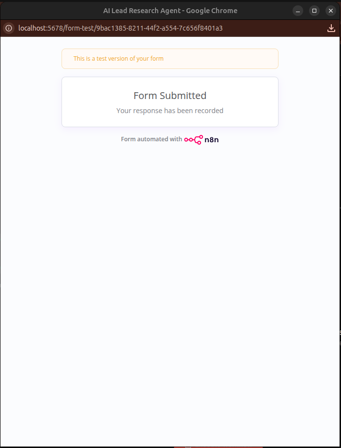

# AI Lead Research Agent (n8n) 🤖

An agentic n8n workflow that takes a company name, autonomously researches it on the web, generates a full B2B lead report using AI, and logs everything to Google Sheets — automatically.

## How It Works

You type a company name into a form and hit Submit. The AI agent takes over:




The workflow runs automatically:


The AI Agent searches the web, analyzes the company, scores the lead, and writes a personalized cold outreach email. Everything gets logged to Google Sheets:


## Agent Flow

```
Form Input (company name)
       ↓
Web Research (Serper API — real Google search)
       ↓
AI Agent (Google Gemini)
  - Decides if more research is needed
  - Calls search tool autonomously if yes
  - Writes company overview
  - Scores lead 1-10 with reasoning
  - Writes personalized cold outreach email
       ↓
Google Sheets (auto-logs every result)
```

The AI Agent is not just a linear pipeline — it has access to a search tool it can call on its own. It thinks and decides what to do next.

## Stack

- **n8n** — workflow automation
- **Google Gemini** — AI model (free)
- **Serper API** — real-time Google search (free tier)
- **Google Sheets** — automatic output logging

## Setup

**1. Import the workflow**

Download `AI_Lead_Research_Agent.json` and import it into your n8n instance via Settings → Import Workflow.

**2. Add your credentials**

- [Serper API key](https://serper.dev) → add to the HTTP Request node header `X-API-KEY`
- [Google Gemini API key](https://aistudio.google.com) → add as Google Gemini credential in n8n
- Google Sheets OAuth2 → connect your Google account in n8n

**3. Create a Google Sheet**

Create a new sheet with these column headers in row 1:
`Company` | `Overview` | `Lead Score` | `Email`

Update the Sheet ID in the Google Sheets node.

**4. Activate the workflow**

Toggle the workflow to Active and open the Production URL. Or use the Test URL to test first.

**5. Submit a company name and watch it run**

## Example Output

**Input:** `Peak Nine`

**Output:**
- Company overview: impact-driven innovation studio helping NGOs, startups, and corporations
- Lead score: 8/10 with detailed reasoning
- Personalized cold outreach email ready to send
- Row automatically added to Google Sheets

## Why This Is Useful

Sales teams waste hours manually researching leads. This agent does it in under 60 seconds, for any company in the world, and logs everything automatically. No manual work required.
